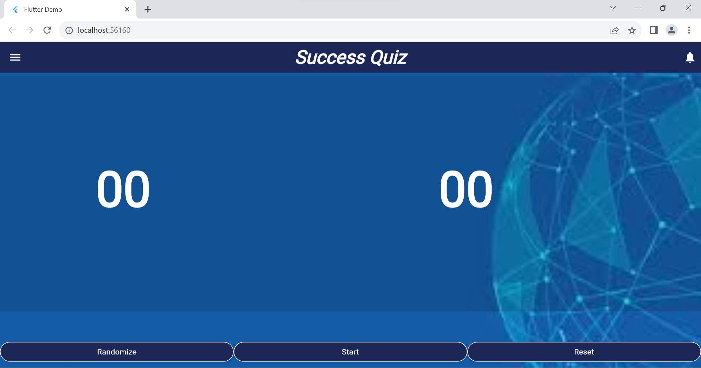
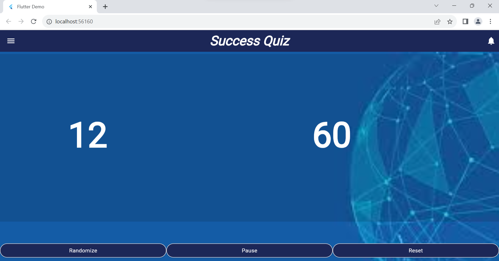
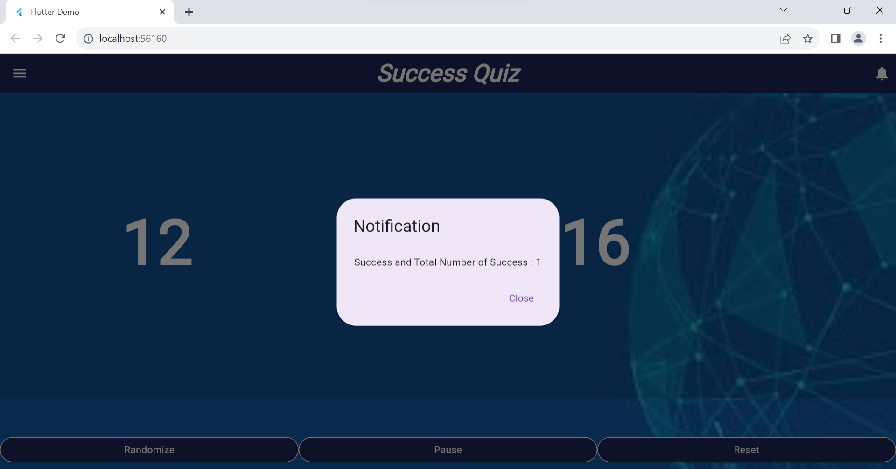
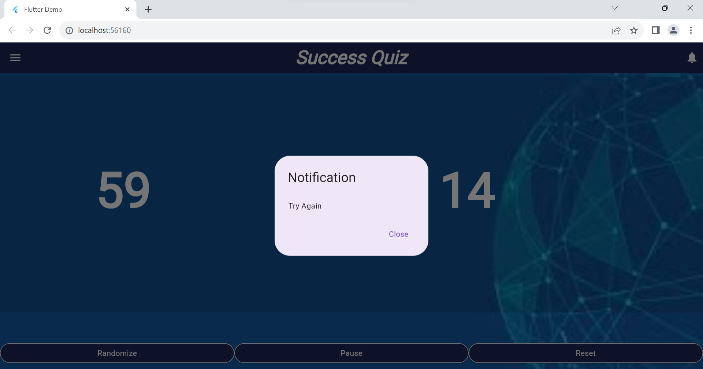

# random_no_with_seconds
The Random Number Generator with current timestamp in Seconds Application 

# Developed By,
Keerthana V , regikeerthana3@gmail.com

The Application includes an AppBar, Random Number Generator from 0 - 59, Timestamp in seconds and a Message, If the random number displayed equals to the ‘seconds’ part of current timestamp, then it displays a success message with total number of times the success achieved since the user installed the app or If the random number displayed is not equals to the seconds part of current timestamp then it displays a try again message.

**Status: In Development**  
**Developed On: Dart & Flutter**   
**Platform: iOS, Android, Web, Windows, Mac**

## What's Done?
- AppBar
- Random Number Generator from 0 - 59
- Timestamp in Seconds
- Success or Try Again Message

## Preview

